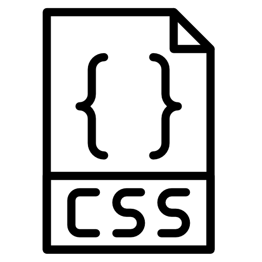
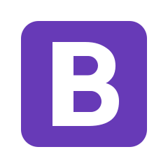

[![LinkedIn][linkedin-shield]][linkedin-url]


<!-- PROJECT LOGO -->
<br />
<p align="center">
  <a href="https://github.com/SabiulSabit">
    
  </a>

  <h3 align="center">Web Dev A to Z</h3>

  <p align="center">
   Here you will find some of the best resourse for web development.
  </p>
</p>


<!-- TABLE OF CONTENTS -->
## Table of Contents
* [About this Project](#about-this-project)
* [Front End](#front-end)
  * [HTML](#html)
  * [CSS](#css)
  * [JavaScript](#javascript)
  * [Bootstrap](#Bootstrap)
* [Back-End](#backend)
  * [Node.js](#nodejs)
  * [PHP](#php)
* [Database](#database)
  * [MySQL](#mysql)
  * [MongoDB](#mongodb) 


## About This Project


Here a beginner web developer will find some of the best resource for his journey through a full stack developer.I have divided the full repository in two major parts. One is for frontend and one is backend.

* Best of Luck :smile:


## Front End
  
### What is Front-End Developmnet?

Front-end web development, also known as client-side development is the practice of producing HTML, CSS and JavaScript for a website or Web Application so that a user can see and interact with them directly.


## HTML
<p align="center">
    
</p>  

Hypertext Markup Language is the standard markup language for documents designed to be displayed in a web browser.

#### Reading + Video  Metarial 

* [W3Schools](https://www.w3schools.com/html/default.asp) - Here you will find the basic of HTML with exapmles.
* [General Assembly Dash](https://dash.generalassemb.ly/) - Here you will find some project in HTML and after completing those you will get certificate. 
* [Traversy Media](https://www.youtube.com/watch?v=UB1O30fR-EE) - This is a Basic Overview video of HTML.
* [HTML for Beginners](https://www.udemy.com/course/hmtl5-training/) - This is Free Course on udemy. It will give you a clear concept of HTML.

## CSS

<p align="center">
    
</p> 

CSS stands for Cascading Style Sheets. CSS describes how HTML elements are to be displayed on screen, paper, or in other media


#### Reading + Video  Metarial 

* [CSS-Tricks](https://css-tricks.com/) - One of the best website for learnig CSS. Every topic is described briefly.
* [W3Schools](https://www.w3schools.com/css/css_intro.asp) - Topic by topic discussion with live demo.
* [Tutorialspoint](https://www.tutorialspoint.com/css/index.htm) - Along with the basic you will find a lots of information about CSS animation
* [CSS Tutorial - Zero to Hero](https://www.youtube.com/watch?v=1Rs2ND1ryYc) -This youtube video is made by FreeCodeCamp. They explain everything pretty well.
* [CSS Animation Tutorial](https://www.youtube.com/playlist?list=PL4cUxeGkcC9iGYgmEd2dm3zAKzyCGDtM5) - One of the best css animation course in youtube by The Net Ninja.


## JavaScript

<p align="center">
    
</p> 

JavaScript (JS) is a lightweight, interpreted, or just-in-time compiled programming language with first-class functions. While it is most well-known as the scripting language for Web pages, many non-browser environments also use it, such as Node.js, Apache CouchDB and Adobe Acrobat. JavaScript is a prototype-based, multi-paradigm, single-threaded, dynamic language, supporting object-oriented, imperative, and declarative (e.g. functional programming) styles.

#### Reading Metarial 

* [JavaScript MDN](https://developer.mozilla.org/en-US/docs/Learn/Getting_started_with_the_web/JavaScript_basics) - This is the Javascript documentation by Mozilla. Which is a very uptodate and easy for learners.
* [devdocs](https://devdocs.io/javascript/) - Here you will find A to Z of JavaScript.
* [javascript.info](https://javascript.info/) - This is another beautiful documentation of JS. Every topic is nicely described with some great examples


#### Video Merarial

* [JavaScript Fundamentals](https://www.udemy.com/course/javascriptfundamentals/) - This is a basic JS course on udemy by Bharath Thippireddy. This will help you to understand how was actually works
* [Learn JavaScript - Full Course for Beginners](https://www.youtube.com/watch?v=PkZNo7MFNFg) - This is also a fundamental course of JS presented by FreeCodeCamp
* [JavaScript](https://www.youtube.com/playlist?list=PLRAV69dS1uWTSu9cVg8jjXW8jndOYYJPP) - This is a nice course by Hitesh Choudhary. He describe JS basic to depth level here.
* [Advanced and Object Oriented JavaScript and ES6](https://www.udemy.com/course/advanced-and-object-oriented-javascript/) - Here you will find the OOP concept of JS. This is also created by Bharath Thippireddy.


#### Extra :boom:

* [FreeCodeCamp.org](https://www.freecodecamp.org/learn/freeCodeCamp.org) - This is a complete course of HTML + CSS + JS. You can check that also.


## Bootstrap

<p align="center">
    
</p> 


Bootstrap is a free and open-source CSS framework directed at responsive, mobile-first front-end web development. It contains CSS- and JavaScript-based design templates for typography, forms, buttons, navigation, and other interface components.

#### Reading Metarial 

* [Bootstrap-official](https://getbootstrap.com/docs/4.5/getting-started/introduction/) - This is the Best documentation in the net for Bootstrap. Write in a very easy way with example.
* [W3School](https://www.w3schools.com/bootstrap4/bootstrap_get_started.asp) - You can also follow this site. But the Official documentation is far better than this. :trollface:

#### Video Merarial


### Installation

1. Get a free API Key at [https://example.com](https://example.com)
2. Clone the repo
```sh
git clone https://github.com/your_username_/Project-Name.git
```
3. Install NPM packages
```sh
npm install
```
4. Enter your API in `config.js`
```JS
const API_KEY = 'ENTER YOUR API';
```


<!-- USAGE EXAMPLES -->
## Usage

Use this space to show useful examples of how a project can be used. Additional screenshots, code examples and demos work well in this space. You may also link to more resources.

_For more examples, please refer to the [Documentation](https://example.com)_


<!-- ROADMAP -->
## Roadmap

See the [open issues](https://github.com/othneildrew/Best-README-Template/issues) for a list of proposed features (and known issues).


<!-- CONTRIBUTING -->
## Contributing

Contributions are what make the open source community such an amazing place to be learn, inspire, and create. Any contributions you make are **greatly appreciated**.

1. Fork the Project
2. Create your Feature Branch (`git checkout -b feature/AmazingFeature`)
3. Commit your Changes (`git commit -m 'Add some AmazingFeature'`)
4. Push to the Branch (`git push origin feature/AmazingFeature`)
5. Open a Pull Request


<!-- LICENSE -->
## License

Distributed under the MIT License. See `LICENSE` for more information.


<!-- CONTACT -->
## Contact

Your Name - [@your_twitter](https://twitter.com/your_username) - email@example.com

Project Link: [https://github.com/your_username/repo_name](https://github.com/your_username/repo_name)


<!-- ACKNOWLEDGEMENTS -->
## Acknowledgements
* [GitHub Emoji Cheat Sheet](https://www.webpagefx.com/tools/emoji-cheat-sheet)
* [Img Shields](https://shields.io)
* [Choose an Open Source License](https://choosealicense.com)
* [GitHub Pages](https://pages.github.com)
* [Animate.css](https://daneden.github.io/animate.css)
* [Loaders.css](https://connoratherton.com/loaders)
* [Slick Carousel](https://kenwheeler.github.io/slick)
* [Smooth Scroll](https://github.com/cferdinandi/smooth-scroll)
* [Sticky Kit](http://leafo.net/sticky-kit)
* [JVectorMap](http://jvectormap.com)
* [Font Awesome](https://fontawesome.com)


<!-- MARKDOWN LINKS & IMAGES -->
<!-- https://www.markdownguide.org/basic-syntax/#reference-style-links -->
[contributors-shield]: https://img.shields.io/github/contributors/othneildrew/Best-README-Template.svg?style=flat-square
[contributors-url]: https://github.com/othneildrew/Best-README-Template/graphs/contributors
[forks-shield]: https://img.shields.io/github/forks/othneildrew/Best-README-Template.svg?style=flat-square
[forks-url]: https://github.com/othneildrew/Best-README-Template/network/members
[stars-shield]: https://img.shields.io/github/stars/othneildrew/Best-README-Template.svg?style=flat-square
[stars-url]: https://github.com/othneildrew/Best-README-Template/stargazers
[issues-shield]: https://img.shields.io/github/issues/othneildrew/Best-README-Template.svg?style=flat-square
[issues-url]: https://github.com/othneildrew/Best-README-Template/issues
[license-shield]: https://img.shields.io/github/license/othneildrew/Best-README-Template.svg?style=flat-square
[license-url]: https://github.com/othneildrew/Best-README-Template/blob/master/LICENSE.txt
[linkedin-shield]: https://img.shields.io/badge/-LinkedIn-black.svg?style=flat-square&logo=linkedin&colorB=555
[linkedin-url]: https://www.linkedin.com/in/sabiulsabit13/
[product-screenshot]: images/screenshot.png
