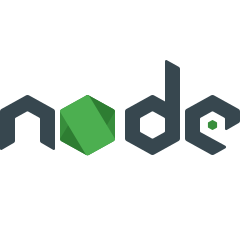
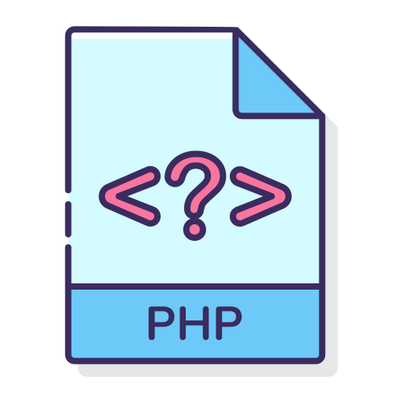
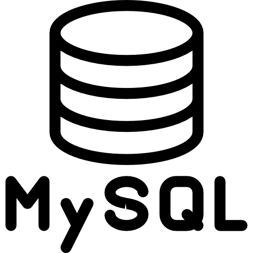
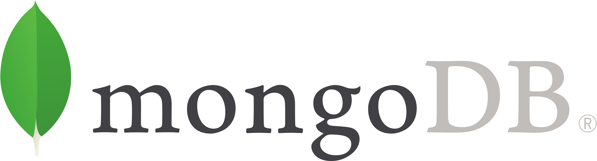

[![LinkedIn][linkedin-shield]](https://www.linkedin.com/in/sabiulhajjaj/)

<!-- PROJECT LOGO -->
 

  

  <h3 align="center">Web Dev A to Z</h3>

  

   Here you will find some of the best resources for web development.
  

        

 

<!-- TABLE OF CONTENTS -->
## Table of Contents
* [About this Project](#about-this-project)
* [Front End](#front-end)
  * [HTML](#html)
  * [CSS](#css)
  * [JavaScript](#javascript)
  * [Bootstrap](#bootstrap)
* [Back End](#back-end)
  * [Node.js](#nodejs)
  * [Nest.js](#nestjs) (Upcoming)
  * [PHP](#php)
* [Database](#database)
  * [MySQL](#mysql)
  * [MongoDB](#mongodb) 

## About This Project

Here a beginner web developer will find some of the best resource for his journey through a full stack developer.I have divided the full repository in two major parts. One is for frontend and one is backend. On those section I added some resourse and course link so that you can follow that. I also added some paid course google drive link. I hope if one is follow those course one by one he/she will definetly abel to work as a full stack developer.

* Best of Luck :smile:

## Front End
  
### What is Front-End Developmnet?

Front-end web development, also known as client-side development is the practice of producing HTML, CSS and JavaScript for a website or Web Application so that a user can see and interact with them directly.

## HTML

    

  

Hypertext Markup Language is the standard markup language for documents designed to be displayed in a web browser.

#### Reading + Video Material 

* [W3Schools](https://www.w3schools.com/html/default.asp) - Here you will find the basic of HTML with exapmles.
* [General Assembly Dash](https://dash.generalassemb.ly/) - Here you will find some project in HTML and after completing those you will get certificate. 
* [Traversy Media](https://www.youtube.com/watch?v=UB1O30fR-EE) - This is a Basic Overview video of HTML.
* [HTML for Beginners](https://www.udemy.com/course/hmtl5-training/) - This is Free Course on udemy. It will give you a clear concept of HTML.

## CSS

    

 

CSS stands for Cascading Style Sheets. CSS describes how HTML elements are to be displayed on screen, paper, or in other media

* [CSS-Tricks](https://css-tricks.com/) - One of the best website for learnig CSS. Every topic is described briefly.
* [W3Schools](https://www.w3schools.com/css/css_intro.asp) - Topic by topic discussion with live demo.
* [Tutorialspoint](https://www.tutorialspoint.com/css/index.htm) - Along with the basic you will find a lots of information about CSS animation
* [CSS Tutorial - Zero to Hero](https://www.youtube.com/watch?v=1Rs2ND1ryYc) -This youtube video is made by FreeCodeCamp. They explain everything pretty well.
* [CSS Animation Tutorial](https://www.youtube.com/playlist?list=PL4cUxeGkcC9iGYgmEd2dm3zAKzyCGDtM5) - One of the best css animation course in youtube by The Net Ninja.

## JavaScript

    

 

JavaScript (JS) is a lightweight, interpreted, or just-in-time compiled programming language with first-class functions. While it is most well-known as the scripting language for Web pages, many non-browser environments also use it, such as Node.js, Apache CouchDB and Adobe Acrobat. JavaScript is a prototype-based, multi-paradigm, single-threaded, dynamic language, supporting object-oriented, imperative, and declarative (e.g. functional programming) styles.

#### Reading Material

* [JavaScript MDN](https://developer.mozilla.org/en-US/docs/Learn/Getting_started_with_the_web/JavaScript_basics) - This is the Javascript documentation by Mozilla. Which is a very uptodate and easy for learners.
* [devdocs](https://devdocs.io/javascript/) - Here you will find A to Z of JavaScript.
* [javascript.info](https://javascript.info/) - This is another beautiful documentation of JS. Every topic is nicely described with some great examples

#### Video Material

* [JavaScript Fundamentals](https://www.udemy.com/course/javascriptfundamentals/) - This is a basic JS course on udemy by Bharath Thippireddy. This will help you to understand how was actually works
* [Learn JavaScript - Full Course for Beginners](https://www.youtube.com/watch?v=PkZNo7MFNFg) - This is also a fundamental course of JS presented by FreeCodeCamp
* [JavaScript](https://www.youtube.com/playlist?list=PLRAV69dS1uWTSu9cVg8jjXW8jndOYYJPP) - This is a nice course by Hitesh Choudhary. He describe JS basic to depth level here.
* [Advanced and Object Oriented JavaScript and ES6](https://www.udemy.com/course/advanced-and-object-oriented-javascript/) - Here you will find the OOP concept of JS. This is also created by Bharath Thippireddy.

#### Extra :boom:

* [FreeCodeCamp.org](https://www.freecodecamp.org/learn/freeCodeCamp.org) - This is a complete course of HTML + CSS + JS. You can check that also.

## Bootstrap

    

 

Bootstrap is a free and open-source CSS framework directed at responsive, mobile-first front-end web development. It contains CSS- and JavaScript-based design templates for typography, forms, buttons, navigation, and other interface components.

#### Reading Material

* [Bootstrap-official](https://getbootstrap.com/docs/4.5/getting-started/introduction/) - This is the Best documentation in the net for Bootstrap. Write in a very easy way with example.
* [W3School](https://www.w3schools.com/bootstrap4/bootstrap_get_started.asp) - You can also follow this site. But the Official documentation is far better than this. :trollface:

#### Video Material

* [Bootstrap 4 Quick Start: Code Modern Responsive Websites](https://www.udemy.com/course/bootstrap-4/) - A great course of bootstrap in Udemy by Brad Hussey.
* [Complete Bootstrap 4 course](https://www.udemy.com/course/bootstrap-4-tutorials/) - This course is designed by Hitesh Choudhary.You will able to build 3 project in this course.

## Back End
  
### What is Back-End Developmnet?

So what makes the front end of a website possible? Where is all that data stored? This is where the back end comes in. The back end of a website consists of a server, an application, and a database.

## Node.js

    

 

Node.js is an open-source, cross-platform, JavaScript runtime environment that executes JavaScript code outside a web browser.

#### Reading Material 

* [Node.js Official Documentation](https://nodejs.org/en/docs/) - If you want to work with Node.js,you have to read this documentation today or tomorrow.
* [Node.js -MDN](https://developer.mozilla.org/en-US/docs/Glossary/Node.js) - This is the best documentation of node js i found so far. Everything is described clearly.
* [Node+Express](https://developer.mozilla.org/en-US/docs/Learn/Server-side/Express_Nodejs/Introduction) - This documentation is about the express.js and node.js integration.
* https://www.nodecertification.com - Node.js Certification Study Guide

#### Video Material

* [Node JS tutorial series for beginners](https://www.youtube.com/playlist?list=PL4cUxeGkcC9gcy9lrvMJ75z9maRw4byYp) - This is a great tutorial for beginners created by The Net Ninja.
* [Udemy - NodeJS - The Complete Guide (incl. MVC, REST APIs, GraphQL)](https://drive.google.com/drive/folders/1sJ-wVqJuuDmxCdVUy598kOY01zQiJejU?usp=sharing) - This is a paid course on udemy. So I put a google drive link so that you can download it from there. Here you will build a ecommerce site.
* [Code with Node: Learn by Doing](https://www.udemy.com/course/code-with-node/) - This is also a good tutorial about Node.js. Here you will build a professional website with Node.js.
* [Udemy - The Complete Node.js Developer Course (3rd Edition)](https://drive.google.com/drive/folders/1nl3feY7WOM4sJvN0d8fP4JD1igoNYdc7?usp=sharing) - This is also a paid course in udemy, so i also put a google drive link here. Here you can leran node js by buliding 3 project in Node.js.

## Nest.js 

Nest.js is a progressive Node.js framework for building efficient, reliable and scalable server-side applications.

#### Reading Material 

* [Nest.js Official Documentation](https://docs.nestjs.com/)

#### Video Material

## PHP

    

 

PHP is a popular general-purpose scripting language that is especially suited to web development. This is the most popular language for web development.

#### Reading Material 

* [W3School](https://www.w3schools.com/php/DEFAULT.asp) - Team W3School write a high quality documentation. Here you will find everything of PHP with some example in each topic.
* [PHP -manual](https://www.php.net/manual/en/) - This is the official documentation of PHP.
* [Tutorialspoint](https://www.tutorialspoint.com/php/index.htm) - This is also a great resource for PHP. You can follow this also.

#### Video Material

* [PHP Tutorial for Beginners](https://www.youtube.com/playlist?list=PL4cUxeGkcC9gksOX3Kd9KPo-O68ncT05o) - This a nice course of PHP created by The Net Ninja. Here he discuss PHP, mySQL and some OOP concept of PHP.
* [Practical PHP: Master the Basics and Code Dynamic Websites](https://www.udemy.com/course/code-dynamic-websites/) - By the end of this course, you will have a thorough understanding of the PHP fundamentals and you will build a Resturent website. 
* [PHP Tutorials](https://www.youtube.com/playlist?list=PL0eyrZgxdwhwBToawjm9faF1ixePexft-) - Great Tutorial by mmtuts. He goes php basic to advance level in this tutorial.

#### Extra :boom:

* [The Complete 2020 PHP Full Stack Web Developer Bootcamp](https://drive.google.com/drive/folders/1kF9jlTH7aEplj-c6U_JyPRhA5I1X9U-i?usp=sharing) - This is a complete course of PHP with HTML ,CSS and JS. This is a paid course so I link a google drive link so that you can download it from there.

## Database

### What is Database?

A database is an organized collection of data, generally stored and accessed electronically from a computer system. Where databases are more complex they are often developed using formal design and modeling techniques.

## MySQL

    

 

MySQL is the most popular database system. It is a relational database. Its name is a combination of "My", the name of co-founder Michael Widenius's daughter, and "SQL", the abbreviation for Structured Query Language.

#### Reading Material 

* [W3School](https://www.w3schools.com/php/php_mysql_intro.asp) - Here MySQL is described with php. But it will help you to understand the basic syntax of MySQL.
* [MySQL-Documentation](https://dev.mysql.com/doc/) - This is the official documentation of MySQL. You can go more depth of MYSQL  by read this documentation.

#### Video Material

* [MySQL Tutorial for Beginners](https://www.youtube.com/watch?v=7S_tz1z_5bA) - This is one of the best course in the internet for MySQL created by Programming with Mosh. He described every part pretty clearly. I hope this one video will clear your concept of MySQL.

## mongoDB

    

 

MongoDB is a cross-platform document-oriented database program. Classified as a NoSQL database program, MongoDB uses JSON-like documents with optional schemas. 

#### Reading + Video Material 

* [mongoDB Official](https://docs.mongodb.com/) - This is the official documentation of mongoDB.
* [mongoDB by Spring](https://docs.spring.io/spring-data/mongodb/docs/current/reference/html/#reference) - This is also a nice documentation of mongoDB. But this is not cover all the section of mongoDB.
* [MongoDB Crash Course](https://www.youtube.com/watch?v=-56x56UppqQ) - This is a mongoDB crush course with Node.js by Traversy Media.
* [MongoDB - noSQL Database | Tutorial](https://www.youtube.com/playlist?list=PLLAZ4kZ9dFpOFJ9JcVW9u4PlSWO-VFoao) - This is a nice course for mongoDB created by Mike Dane. I think this course will help you to understand the mongoD concept.

------------------------------------------------------------ Thank You:heartbeat::heartbeat: ------------------------------------------------------------

<!-- MARKDOWN LINKS & IMAGES -->

[linkedin-shield]: https://img.shields.io/badge/-LinkedIn-black.svg?style=flat-square&logo=linkedin&colorB=555
[linkedin-url]: https://www.linkedin.com/in/sabiulsabit13/

